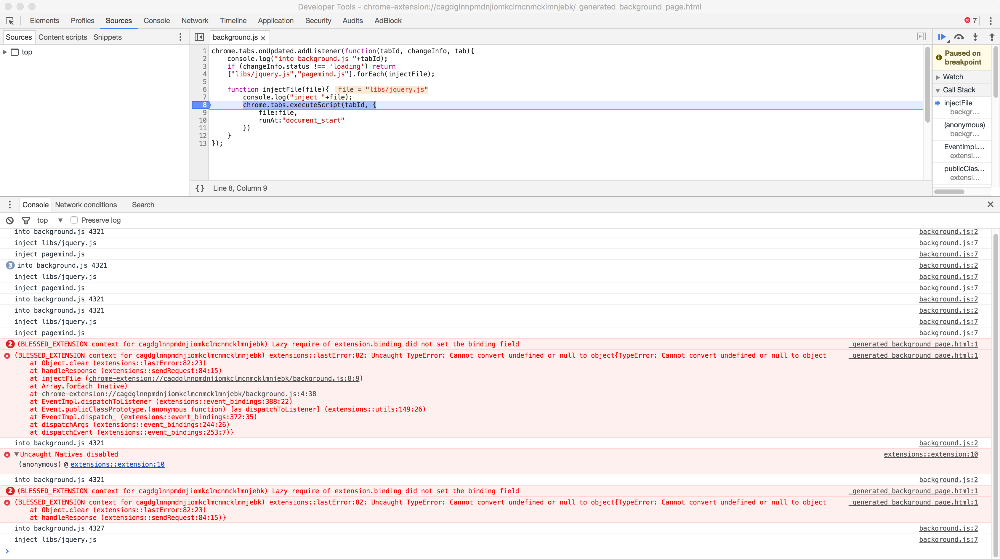

## 记录

1. 当执行chrome.tabs.executeScript时显示如下错误的时候是因为，没有加回掉函数(callback)
    >(BLESSED_EXTENSION context for cagdglnnpmdnjiomkclmcnmcklmnjebk) extensions::lastError:82: Uncaught TypeError: Cannot convert undefined or null to >object{TypeError: Cannot convert undefined or null to object
    >at Object.clear (extensions::lastError:82:23)
    >at handleResponse (extensions::sendRequest:84:15)
    >at injectFile (chrome-extension://cagdglnnpmdnjiomkclmcnmcklmnjebk/background.js:8:9)
    >at Array.forEach (native)
    >at chrome-extension://cagdglnnpmdnjiomkclmcnmcklmnjebk/background.js:4:38
    >at EventImpl.dispatchToListener (extensions::event_bindings:388:22)
    >at Event.publicClassPrototype.(anonymous function) [as dispatchToListener] (extensions::utils:149:26)
    >at EventImpl.dispatch_ (extensions::event_bindings:372:35)
    >at dispatchArgs (extensions::event_bindings:244:26)
    >at dispatchEvent (extensions::event_bindings:253:7)}
    如图：
    